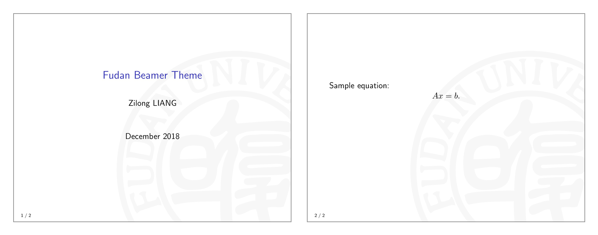

# Fudan Beamer Theme

_(Status: alpha)_

An unofficial beamer theme for Fudan University.

Usage: Copy `logo-background.pdf`, `logo-titlepage.pdf` and `beamerthemefudan.sty` to your project directory, then write
```
\usetheme{fudan}
```
in your beamer document.


